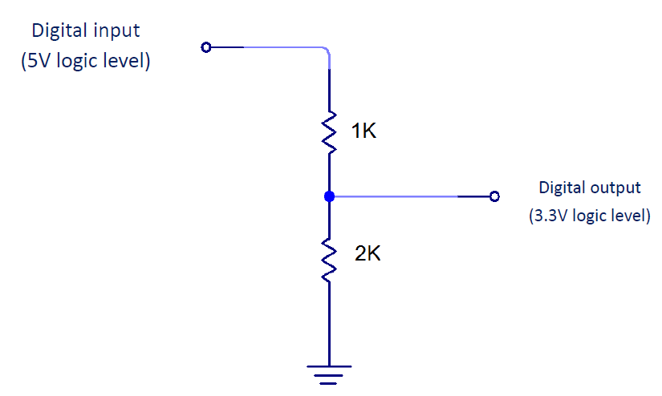
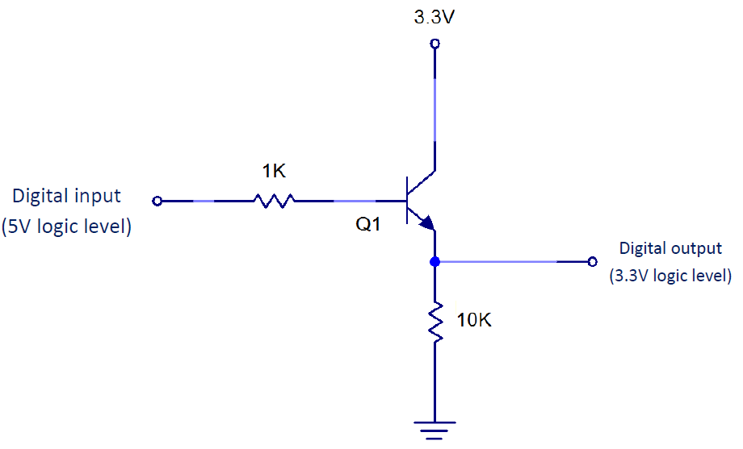
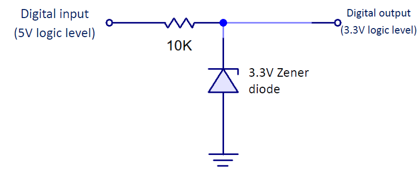
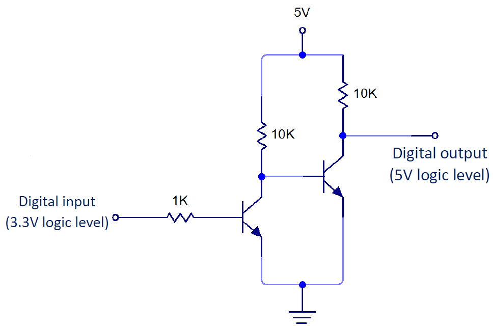
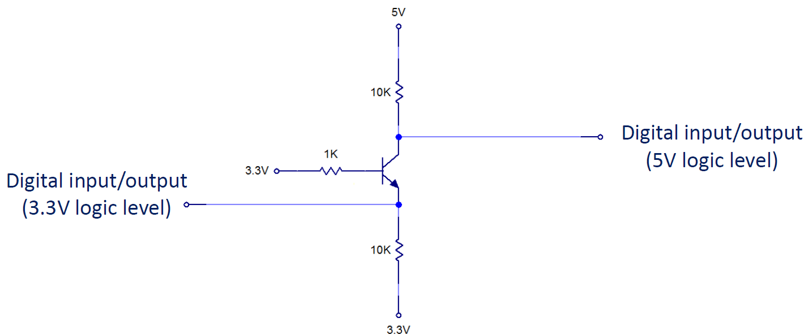

# Interfacing Circuits  

## Down-shifting logic levels

### Voltage divider

- Simple and effective  
- The resistance of the bottom resistor is twice of the top one.

  
### Transistor-based techniques

- High-side switching  
- Choose base resistor size to ensure saturation mode (may not be 1K)  

### Zener diode

- The voltage drop of the Zenerdiode is 3.3V.  

## Up-shifting logic levels

### Double-transistor techniques

- Two transistors (low-side switching)  
- Each transistor acts as an inverter  
- Choose base resistor size to ensure saturation mode (may not be 1K)  

### Single transistor techniques

