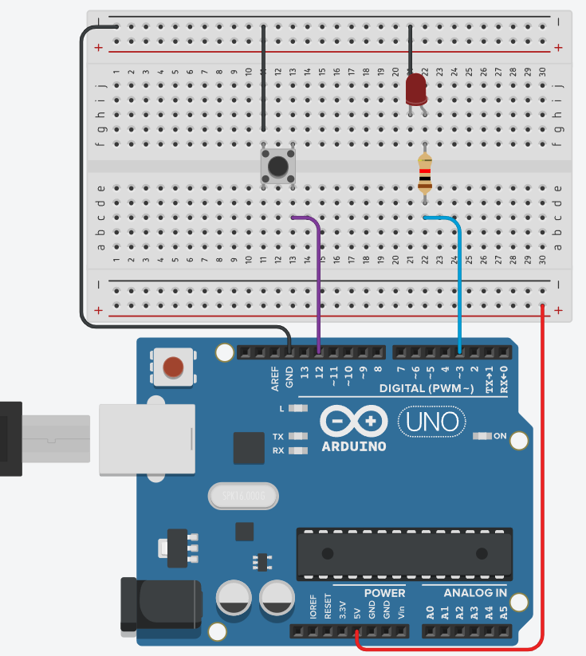

# Non-volatile Memory 

## EEPROM Library  
#include <EEPROM.h>  
> 
> The microcontroller on the Arduino and Genuino AVR based board has EEPROM: memory whose values are kept when the board is turned off (like a tiny hard drive).  
> This library enables you to read and write those bytes.  
> The supported micro-controllers on the various Arduino and Genuino boards have different amounts of EEPROM:
> - 1024 bytes on the ATmega328P  
> - 512 bytes on the ATmega168 
> - ATmega8, 4 KB (4096 bytes) on the ATmega1280 and ATmega2560  
>
> The Arduino and Genuino 101 boards have an emulated EEPROM space of 1024 bytes.  
> Source: https://www.arduino.cc/en/Reference/EEPROM

### Examples:  

- EEPROM Clear: Clear the bytes in the EEPROM.  
- EEPROM Read: Read the EEPROM and send its values to the computer.  
- EEPROM Write: Stores values from an analog input to the EEPROM.  
- EEPROM Crc: Calculates the CRC of EEPROM contents as if it was an array.  
- EEPROM Get: Get values from EEPROM and prints as float on serial.  
- EEPROM Iteration: Understand how to go through the EEPROM memory locations.  
- EEPROM Put: Put values in EEPROM using variable semantics.  
- EEPROM Update: Stores values read from A0 into EEPROM, writing the value only if different, to increase EEPROM life.  

### Project: EEPROM

The project uses the EEPROM on Arduino UNO to save the state of LED.  
It uses EEPROM.update and EEPROM.Read.

Circuit Diagram

