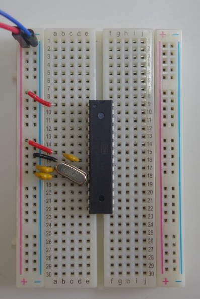
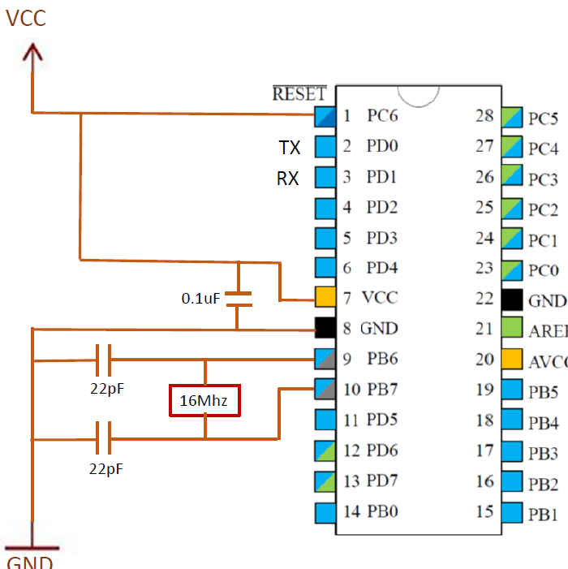
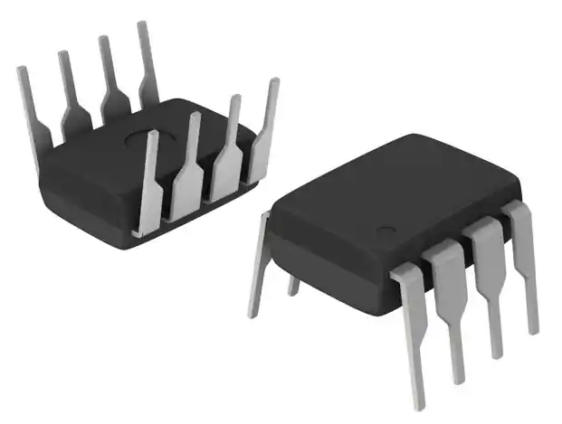
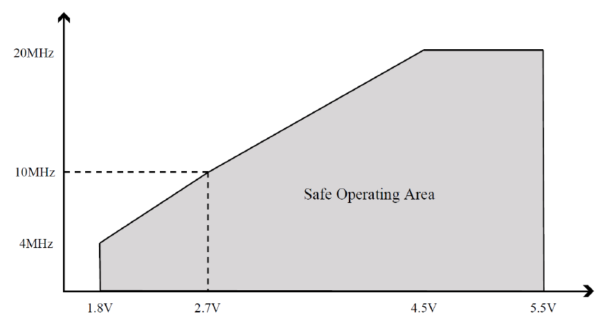

# Power Management  

## Reducing power consumption  
- Hardware-based  
- Software-based  

### Hardware-based

Take the ATmega328p out of Arduino (Easiest of all)
  
  
-------------------------------------------------------------------------------------------------------------------------------------------------------
  
 

Reason of Arduino having high power consumption:  
- Arduino uses a linear voltage regulator. Linear voltage regulators are known to be very inefficient (Around 70% efficiency)
- Arduino has onboard LEDs that consume power.
- Arduino has ATmega16u that handles USB-Serial conversion. It consumes power.  
  
-------------------------------------------------------------------------------------------------------------------------------------------------------

  
  

Use efficient voltage regulators (or run directly from batteries if possible)
  
  
-------------------------------------------------------------------------------------------------------------------------------------------------------
  Instead of using linear voltage regulator, use switching regulators.
  
  They have 80-90% efficiency.
  
  
  
-------------------------------------------------------------------------------------------------------------------------------------------------------

  

Lower the CPU clock speed and Lower the operating voltage
  
  
-------------------------------------------------------------------------------------------------------------------------------------------------------
- Reducing the operating voltage without reducing clock speed appropriately could make the CPU behave erratically.  
- Reduce both clock speed and operating voltage to lower current consumption.  

  
-------------------------------------------------------------------------------------------------------------------------------------------------------

 
  
### Software-based

-------------------------------------------------------------------------------------------------------------------------------------------------------

- #### Turning off external devices while they are not being used

- #### [Setting unused GPIO pins as output](./Set_Pins_Output/Set_Pins_Output.ino)

- #### [Turning off ADC](./Turn_Off_ADC/Turn_Off_ADC.ino)

- #### [Turning off analog comparator](./Turn_Off_AnalogComparator/Turn_Off_AnalogComparator.ino)

- #### [Sleeping](./Sleep/Sleep.ino)

- #### [Turning off brown-out detector](./Deep_Sleep/Deep_Sleep.ino)

- #### Turning off timers

-------------------------------------------------------------------------------------------------------------------------------------------------------
